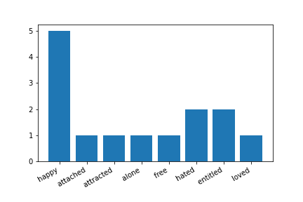

# Helpdesk Ticket Sentiment Analysis (NLP)

A multi-model sentiment and emotion analysis system for incoming helpdesk/call-center calls — built for **Smart India Hackathon 2023** (Problem Statement Code **SIH1356**, Ministry of Commerce & Industries).

## Team

Built by **Team TechTitansUnited**, Bennett University, as a national-hackathon submission.

| | |
|---|---|
| Team | TechTitansUnited, SIH 2023 |
| Institute | Bennett University |
| Problem Statement | SIH1356 — Sentiment analysis of incoming calls on Helpdesk |
| My role | AI/ML — sentiment scoring models & speech pipeline |

## Problem

Helpdesks and call centers handle a high volume of customer calls with no automated way to gauge sentiment in real time. This project explores that problem from several angles at once: a live speech-to-sentiment demo, a from-scratch text emotion analyzer, a text classification baseline, and a speech-based emotion recognizer — reflecting the different approaches the team evaluated before settling on a direction for the final prototype.

## What's in this repo

### 1. Real-time prototype (`app/`)
A working Streamlit app: records audio → transcribes via Google Speech Recognition → scores sentiment with VADER → displays the result live.
```bash
streamlit run app/helpdesk_sentiment_analysis_prototype.py
```
Demo video: https://www.youtube.com/watch?v=eomqZ-sHPiw

### 2. Text emotion lexicon analysis (`notebooks/01_text_sentiment_lexicon_analysis.ipynb`)
A from-scratch emotion breakdown: tokenizes a transcript, strips stopwords, and maps surviving words against an emotion lexicon (`data/emotions.txt`) to plot an emotion-frequency chart, then cross-checks the result with VADER's polarity score. Output from an actual run:



### 3. Text sentiment baseline — Logistic Regression (`notebooks/02_text_sentiment_logistic_regression.ipynb`)
A TF-IDF + Logistic Regression baseline for classifying labeled text as positive/negative, with a custom-input test cell at the end. **Note:** this was an exploratory baseline — the original notebook had a preprocessing bug (`.fit_transform` was called on the test set instead of `.transform`), which is fixed in this version. No accuracy figure is reported here since the training CSV wasn't included in the original files; drop a labeled sentiment dataset at `data/train.csv` to run it end-to-end.

### 4 & 5. Speech emotion recognition (`notebooks/03_..._cnn.ipynb`, `notebooks/04_..._lstm.ipynb`)
Two architectures trained on the TESS (Toronto Emotional Speech Set) dataset, extracting audio features via `librosa` and classifying emotion directly from voice:
- **Conv1D model** — reached **98.9% test accuracy**
- **LSTM model** — reached **~99.9% validation accuracy**

(TESS is a small, clean, acted-emotion dataset, which is why accuracy is very high — it's a good proof of concept for voice-based emotion detection, not a claim of real-world call-center performance.)

## Repository Structure

```
helpdesk-ticket-sentiment-analysis/
├── app/
│   └── helpdesk_sentiment_analysis_prototype.py   # live Streamlit demo (VADER + speech recognition)
├── notebooks/
│   ├── 01_text_sentiment_lexicon_analysis.ipynb   # from-scratch emotion lexicon breakdown
│   ├── 02_text_sentiment_logistic_regression.ipynb# TF-IDF + Logistic Regression baseline
│   ├── 03_speech_emotion_recognition_cnn.ipynb    # Conv1D on TESS — 98.9% test accuracy
│   └── 04_speech_emotion_recognition_lstm.ipynb   # LSTM on TESS — ~99.9% val accuracy
├── data/
│   ├── emotions.txt         # word → emotion category lexicon
│   └── sample_transcript.txt# neutral sample call transcript for the lexicon notebook
├── assets/
│   └── emotion_distribution_output.png
├── requirements.txt
├── LICENSE
└── README.md
```

## Running it

```bash
pip install -r requirements.txt
```

- **Live demo:** `streamlit run app/helpdesk_sentiment_analysis_prototype.py`
- **Notebooks:** open any notebook in `notebooks/` and run top to bottom. Notebooks 3 & 4 expect the [TESS dataset](https://www.kaggle.com/datasets/ejlok1/toronto-emotional-speech-set-tess) available locally (adjust the data path at the top of each notebook).

## Notes

- The full hackathon proposal additionally covered call summarization, dashboard analytics, and secure metadata storage (React/Node/MongoDB) — this repo covers the AI/ML layer the team prototyped and tested.

## Author

Ch. Navya Naidu — AI/ML, Team TechTitansUnited
